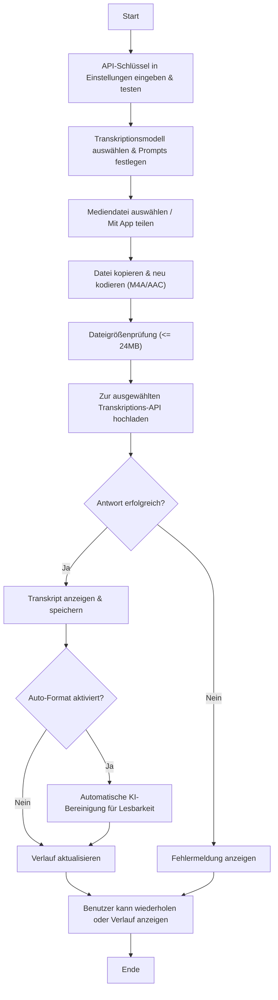

# Android AI Transkriptions-App

[GitHub Repository](https://github.com/dhcgn/AIAudioTranscription) • [Copilot-Anweisungen](.github/copilot-instructions.md)

## Überblick

Diese App ermöglicht es Ihnen, Mediendateien (Audio oder Video) einfach mit KI zu transkribieren. Benutzer können Mediendateien hochladen, teilen oder öffnen, die dann neu kodiert und an mehrere Transkriptionsmodelle gesendet werden. Die App unterstützt die traditionelle Whisper-1-Transkription sowie neuere GPT-4o-Varianten, die entweder direkt transkribieren oder eine verbesserte Ausgabe liefern. KI-gestützte Nachbearbeitung verbessert die Lesbarkeit der Transkripte zusätzlich. Alle Transkriptionen und Einstellungen werden lokal gespeichert – mit Ihrem API-Schlüssel sicher im verschlüsselten Speicher.

## Hauptfunktionen

- **Medienhandhabung:**  
  - Wählen, teilen oder öffnen Sie Mediendateien direkt von Ihrem Gerät.
  - Direkte Transkription von Sprachnachrichten aus Messaging-Apps wie WhatsApp, Telegram oder Signal.
  - Automatische Neukodierung mit FFmpegKit in das **M4A/AAC**-Format für alle Transkriptionsmodelle.
  - Dateigrößenprüfung (max. 24MB nach der Verarbeitung) für einen reibungslosen Betrieb.

- **Mehrere Transkriptionsmodelle:**  
  - **Whisper-1:** Traditionelles Audio-Transkriptionsmodell.
  - **GPT-4o Transcribe:** Speziell für Transkriptionsaufgaben optimiert.
  - **GPT-4o-mini Transcribe:** Effizientes Transkriptionsmodell für kostengünstige Verarbeitung.

- **KI-gestützte Bereinigung:**  
  - Verbessern Sie die Lesbarkeit von Transkripten mit KI-gesteuerter Bereinigung unter Verwendung von GPT-4o-Chat-Vervollständigungen.
  - Anpassbare Bereinigungs-Prompts stellen sicher, dass der ursprüngliche Inhalt erhalten bleibt und gleichzeitig die Klarheit verbessert wird.
  - Optionale Auto-Format-Einstellung zur automatischen Verbesserung der Lesbarkeit nach jeder Transkription.

- **Lokaler Verlauf & Einstellungen:**  
  - Führen Sie einen lokalen Verlauf von Transkriptionen mit Details wie Sprache, Prompt, Quelle und verwendetem Modell.
  - Sichere API-Schlüsselspeicherung mit EncryptedSharedPreferences.
  - In-App-Einstellungen ermöglichen Ihnen:  
    - Ihren OpenAI-API-Schlüssel zu speichern und zu testen.  
    - Transkriptionsmodelle und Spracheinstellungen zu konfigurieren.  
    - Prompts für Transkription und KI-Bereinigung anzupassen.
    - Auto-Format zu aktivieren, um Transkriptionen nach der Verarbeitung automatisch zu verbessern.

- **Verbesserungen der Benutzererfahrung:**  
  - Unterstützung für freigegebene Intents (von anderen Apps) und direkten Dateizugriff.
  - Wiederholungsfunktion zur Neuverarbeitung von Dateien mit aktualisierten Parametern.
  - Klare, responsive Benutzeroberfläche mit Jetpack Compose und modernen Android-Architekturpraktiken.

- **Anwendungsfälle:**
  - Sprachnachrichten in Text umwandeln für einfaches Lesen und Teilen
  - Sprachnachrichten-Inhalte archivieren und durchsuchen
  - Sprachnachrichten für hörgeschädigte Benutzer zugänglich machen
  - Schnelle Transkription von Besprechungsaufzeichnungen und Vorlesungen

## So funktioniert es

1. **Initialisierung & Einrichtung:**  
   - Geben Sie Ihren OpenAI-API-Schlüssel auf dem Einstellungsbildschirm ein und testen Sie ihn.
   - Wählen Sie Ihr Transkriptionsmodell und legen Sie benutzerdefinierte Prompts oder Spracheinstellungen fest.

2. **Medienverarbeitung:**  
   - Wählen Sie eine Mediendatei aus oder teilen Sie eine mit der App.
   - Die Datei wird kopiert, in das AAC-Format neu kodiert und ihre Größe wird validiert.

3. **Transkription & Bereinigung:**  
   - Die verarbeitete Datei wird zur ausgewählten Transkriptions-API hochgeladen.
   - Nach der Transkription wird der Text optional mit einem KI-Bereinigungs-prozess verbessert.
   - Wenn Auto-Format aktiviert ist, wird die Bereinigung automatisch angewendet.
   - Das endgültige Transkript wird angezeigt und lokal gespeichert.

4. **Verlauf & Verwaltung:**  
   - Zeigen Sie vergangene Transkriptionen zusammen mit Details an (z.B. verwendetes Modell, Sprache, Zeitstempel).
   - Kopieren oder löschen Sie Verlaufseinträge nach Bedarf.

## Flussdiagramm

## Datenschutz- und Rechtshinweis

- **Verarbeitung durch Dritte:**  
  Ihre Mediendateien werden an die Server von OpenAI gesendet. Stellen Sie sicher, dass Sie die Berechtigung haben, sie zu teilen und zu transkribieren.
  
- **Sensible Daten:**  
  Transkribieren Sie keine Inhalte mit sensiblen persönlichen oder vertraulichen Informationen.

- **Benutzerverantwortung:**  
  Verwenden Sie Ihren eigenen OpenAI-API-Schlüssel. Sie sind für alle anfallenden Kosten verantwortlich und müssen die Nutzungsbedingungen von OpenAI einhalten.

## Nächste Schritte

Zukünftige Verbesserungen umfassen:
- Refactoring der UI-Statusverwaltung in ViewModels.
- Konsolidierung duplizierter Codes und weitere Übernahme von Kotlin-Coroutinen mit Retrofit's Suspend-Funktionen.
- Verbesserung der Benutzeroberfläche und des Benutzerinteraktionsflusses.
