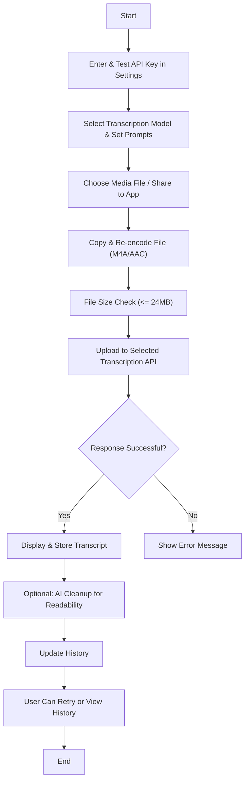

# Android AI Transcription App

[GitHub Repository](https://github.com/dhcgn/AIAudioTranscription) • [Copilot Instructions](.github/copilot-instructions.md)

## Overview

This app lets you easily transcribe media files (audio or video) using AI. Users can upload, share, or open media files which are then re-encoded and sent to multiple transcription models. The app supports traditional Whisper-1 transcription, as well as newer GPT-4o variants that either directly transcribe or provide enhanced output. AI-powered post-processing further improves transcript readability. All transcriptions and settings are stored locally—with your API key secured in encrypted storage.

## Key Features

- **Media Handling:**  
  - Select, share, or open media files directly from your device.
  - Direct transcription of voice messages from messaging apps like WhatsApp, Telegram, or Signal.
  - Automatic re-encoding using FFmpegKit to **M4A/AAC** format for all transcription models.
  - File size check (max. 24MB after processing) to ensure smooth operation.

- **Multiple Transcription Models:**  
  - **Whisper-1:** Traditional audio transcription model.
  - **GPT-4o Transcribe:** Specifically optimized for transcription tasks.
  - **GPT-4o-mini Transcribe:** Efficient transcription model for cost-effective processing.

- **AI-Powered Cleanup:**  
  - Enhance transcript readability with AI-driven cleanup using GPT-4o chat completions.
  - Customizable cleanup prompts ensure the original content is preserved while improving clarity.
  - **Automatic Cleanup:** Enable automatic cleanup in Settings to have every transcription automatically cleaned up without manual intervention.
  - On-demand cleanup: Use the "Cleanup with AI" button to manually clean up any transcription when needed.

- **Local History & Settings:**  
  - Maintain a local history of transcriptions including details like language, prompt, source, and model used.
  - Secure API key storage using EncryptedSharedPreferences.
  - In-app Settings allow you to:  
    - Save and test your OpenAI API key.  
    - Configure transcription models and language preferences.  
    - Customize prompts for both transcription and AI cleanup.
    - Enable automatic cleanup to have transcriptions automatically cleaned up after each transcription.

- **User Experience Enhancements:**  
  - Support for shared intents (from other apps) and direct file access.
  - Retry functionality for reprocessing files with updated parameters.
  - Clear, responsive UI built with Jetpack Compose and modern Android architecture practices.

- **Use Cases:**
  - Convert voice messages to text for easy reading and sharing
  - Archive and search through voice message content
  - Make voice messages accessible for hearing-impaired users
  - Quick transcription of meeting recordings and lectures

## How It Works

1. **Initialization & Setup:**  
   - Enter and test your OpenAI API key in the Settings screen.
   - Choose your transcription model and set any custom prompts or language preferences.

2. **Media Processing:**  
   - Select a media file, or share one to the app.
   - The file is copied, re-encoded to AAC format, and its size is validated.

3. **Transcription & Cleanup:**  
   - The processed file is uploaded to the selected transcription API.
   - Once transcribed, the text is optionally enhanced with an AI cleanup process.
   - The final transcript is displayed and stored locally.

4. **History & Management:**  
   - View past transcriptions along with details (e.g., model used, language, timestamp).
   - Copy or delete history entries as needed.

## Flowchart

## Privacy & Legal Notice

- **Third-Party Processing:**  
  Your media files are sent to OpenAI’s servers. Ensure you have permission to share and transcribe them.
  
- **Sensitive Data:**  
  Do not transcribe content with sensitive personal or confidential information.

- **User Responsibility:**  
  Use your own OpenAI API key. You are responsible for any costs incurred, and you must comply with OpenAI’s Terms of Service.

## Next Steps

Future enhancements include:
- Refactoring UI state management into ViewModels.
- Consolidating duplicated code and further adopting Kotlin coroutines with Retrofit’s suspend functions.
- Enhancing the UI and user interaction flow.
