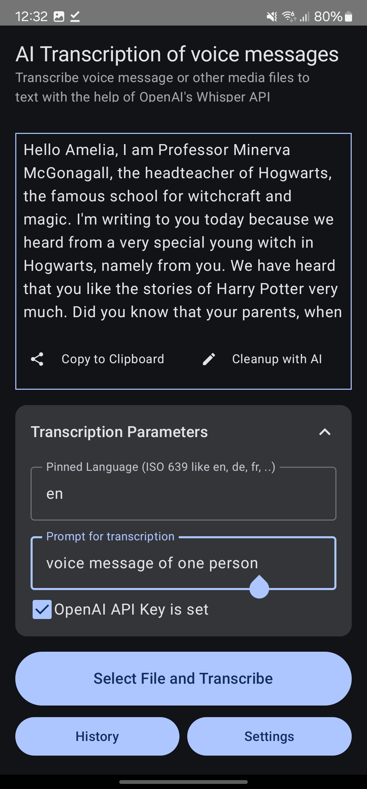
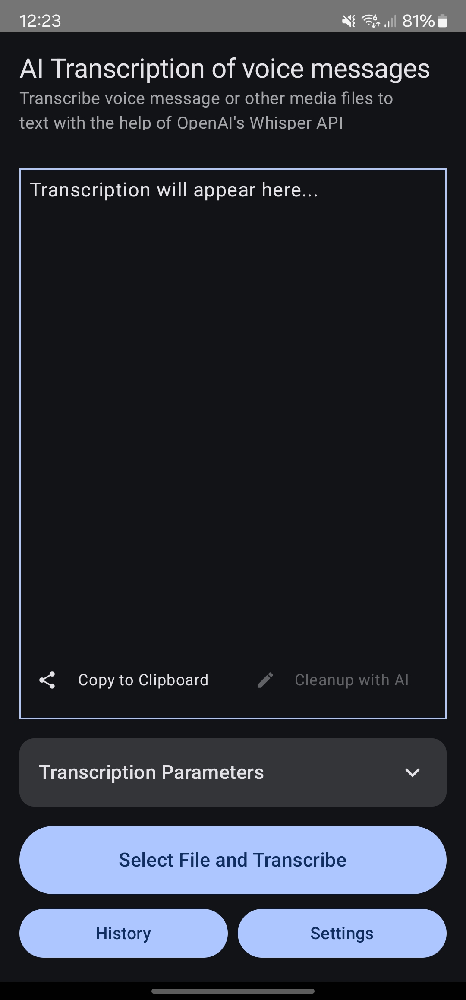
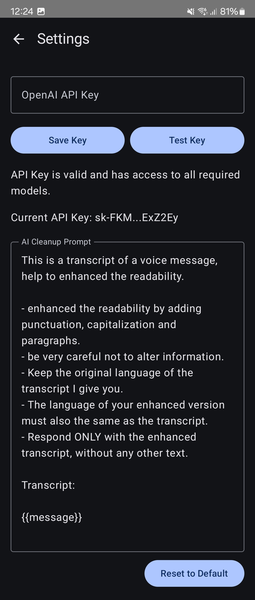
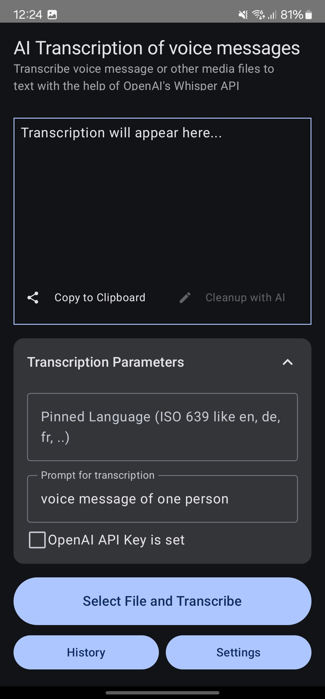
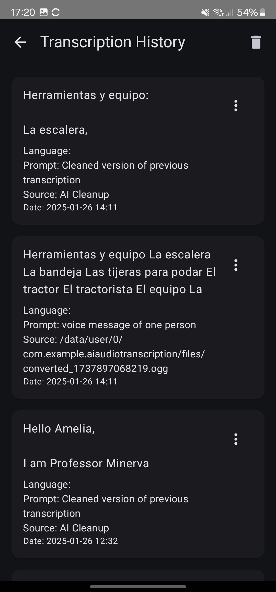
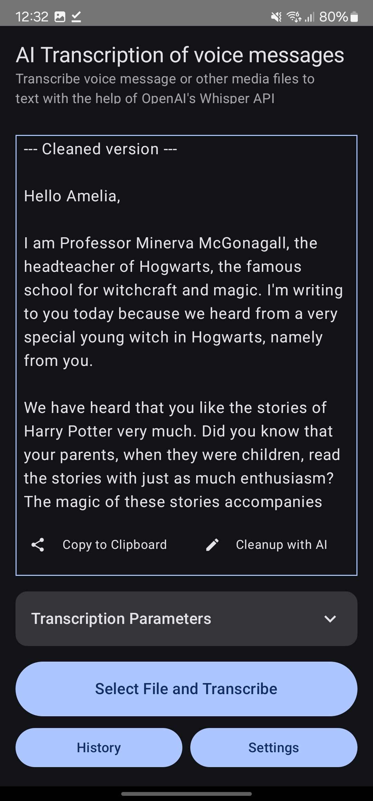
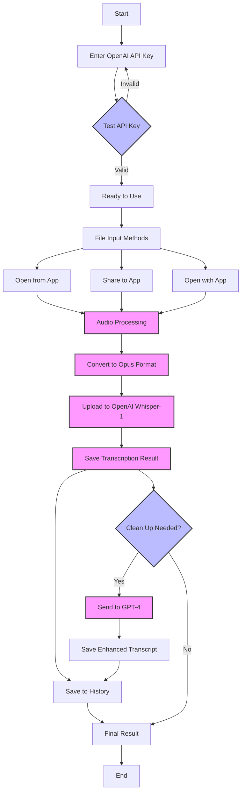

# Android AI Transcription App

[gitingest for ai inference usage ](https://gitingest.com/dhcgn/AIAudioTranscription)

## Introduction

This project is a test project in which I wanted to evaluate the possibilities of developing an Android app with AI tools, although my focus as a software developer lies in completely different areas.

I am annoyed by voice messages in the various messenger apps I receive. Therefore, my goal was to develop an Android app in which I can upload, share or open media files of any kind and then transcribe them with a third-party API. As a bonus feature, it should also be possible to give the transcript a structure so that the otherwise continuous text is easier to read. All requests should also be stored locally in the app and the required API key - which is provided by the user - should be stored in encrypted form.

Android Studio with Gemini and VS Code with GTP-4o and Sonnet 3.5 were used for this test project.

This project was a total success for me, I could develop an Android app at an insane speed. And learn a lot about the development of Android apps. 

The next steps are refactoring with the adaptation of best practice patterns and adding a few more features.

And yes, this app doesn't win any prizes for modern design and best possible user-friendliness. 

### ⚠️ Important Privacy & Legal Notice

Before using this app, please be aware of the following important considerations:

1. **Third-Party Processing**: All voice messages are sent to OpenAI's servers for transcription using their Whisper API. Make sure you have the right to share these recordings with third parties.

2. **Personal Data**: Do not transcribe voice messages containing sensitive personal information, confidential data, or content you don't have permission to share.

3. **Terms of Service**: Since you'll be using your own OpenAI API key, you must:
   - Read and accept OpenAI's Terms of Service
   - Comply with OpenAI's usage policies and data handling requirements
   - Understand that you are responsible for any costs incurred through API usage

4. **Consent**: Ensure you have proper consent from all parties involved in the voice messages before transcribing them.

The app developers are not responsible for any misuse or unauthorized sharing of voice messages. Use this app responsibly and in compliance with applicable privacy laws and regulations.

## Download

See **Releases** for the latest version.

## Features

- Upload, share or open media files
- Transcribe media files with a third-party API
- AI powered post-processing to structure the transcript
- Store requests locally
- Store the API key in encrypted form

### Minor Features

- Prompting and pin the language for whisper-1 usage for better results
- Translation by whisper-1 (not be best)

## Used AI Models

- GPT-4o for structure the transcript
- Whisper-1 for transcribe the media files

## Screenshots

### Main Screen

### Settings Screen

### Parameters Settings

### History Screen

### Transcription Result

### Transcription Result with Structure

## Flowchart

